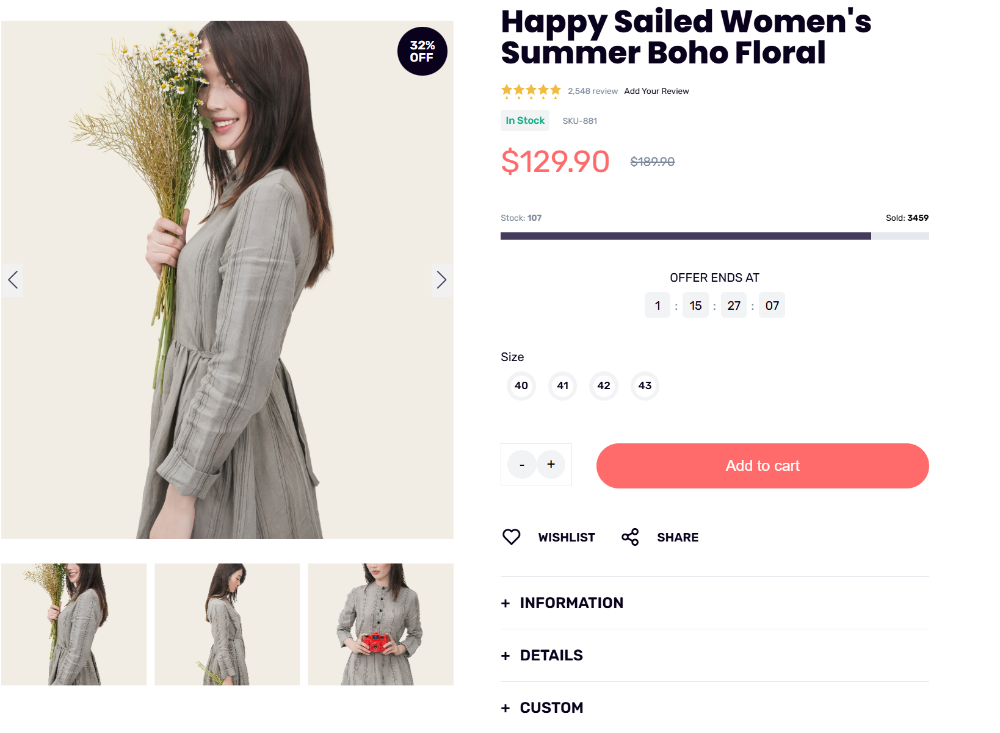

<!DOCTYPE html>
<html lang="en">
<head>
 
</head>
<body>
    

        

            <h1>Featured Products</h1>
            
            

        

        

            <h1>Trending Products</h1>
            
            

        

        

            <h1>Featured Products</h1>
            
            

        

        

            <h1>Page Offer</h1>
            
            

        

    

</body>
</html>
